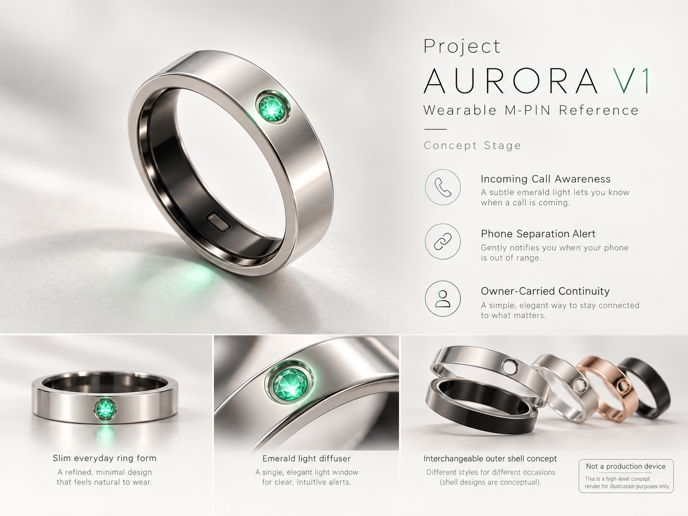

# Project AURORA

**M-PIN Wearable Physical Reference Project**

> Owner-controlled continuity, carried by the Owner.

Project AURORA is an experimental wearable physical reference project for M-PIN.

AURORA explores whether Owner-controlled identity, continuity, and personal state can eventually remain physically with the Owner through a small wearable device such as a ring.

AURORA is a project name, not a commercial product name.

---

## AURORA V1 Concept

> **Concept render — not a production device.**  
> This image is a high-level visual reference for the public AURORA V1 concept. Final dimensions, materials, internal architecture, manufacturing methods, and production design may change.

---

## Purpose

M-PIN proposes that persistent personal state should remain under the Owner's control rather than being permanently bound to a single AI platform, assistant, device, or service.

Project AURORA explores a wearable form of that principle.

A ring is especially interesting because it can remain physically with the Owner throughout everyday life.

---

## Initial Reference — V1

AURORA V1 intentionally focuses on only two primary functions.

### Incoming Call Awareness

When the paired smartphone receives a call, AURORA provides a tactile vibration alert and may provide a subtle emerald light signal.

The purpose is to help the Owner notice incoming calls even when the smartphone is in silent or vibration mode.

### Phone Separation Awareness

When the paired smartphone moves beyond an appropriate Bluetooth proximity threshold, or the connection is lost, AURORA provides a distinct vibration and light alert.

The purpose is simple:

**Help the Owner notice before leaving the phone behind.**

---

## Design Principle

AURORA V1 intentionally avoids unnecessary functions.

The first reference does not require:

- Health tracking
- Heart-rate sensing
- SpO2 sensing
- Sleep tracking
- Display
- Clock
- Complex gesture control

The initial design priority is:

**Make the wearable simple enough to feel like a ring.**

---

## Public Concept Direction

The public AURORA concept may explore:

- A slim everyday ring form
- Tactile alerts
- A single emerald light diffuser
- Phone separation awareness
- Incoming call awareness
- Owner-carried continuity
- Interchangeable outer-shell concepts
- Multiple ring sizes through passive mechanical sizing components

These are public concept directions, not frozen production specifications.

---

## Relationship to M-PIN

AURORA is not intended to replace M-PIN.

It explores whether a future wearable device could become one physical interface for Owner-controlled identity, continuity, and portable state.

The AI service may change.

The smartphone may change.

The physical device may change.

**The Owner's continuity should remain with the Owner.**

---

## Public / Non-Public Boundary

Project AURORA is intentionally developed with a public concept layer and a non-public implementation layer.

### Public

The following may be openly documented:

- Project purpose
- User experience goals
- High-level feature concepts
- Concept renders
- Public reference architecture
- M-PIN relationship
- Prototype status
- Public development history

### Intentionally Non-Public

The following may remain private during development:

- Exact mechanical dimensions and tolerances
- PCB layout
- Battery specifications and suppliers
- RF tuning details
- Antenna implementation
- Waterproofing and sealing process details
- Size-insert locking geometry
- Assembly-jig design
- Manufacturing partners
- Supplier pricing
- Production negotiation records
- Security-sensitive implementation details

This boundary allows AURORA to remain inspectable as a public reference project without exposing unnecessary manufacturing or security-sensitive details.

---

## Status

**Concept / Early Prototype Stage**

AURORA is currently a reference project and is not a production device, medical device, certified safety product, or commercially released product.

Hardware, dimensions, connectivity methods, materials, security mechanisms, and implementation details may change as the project develops.
