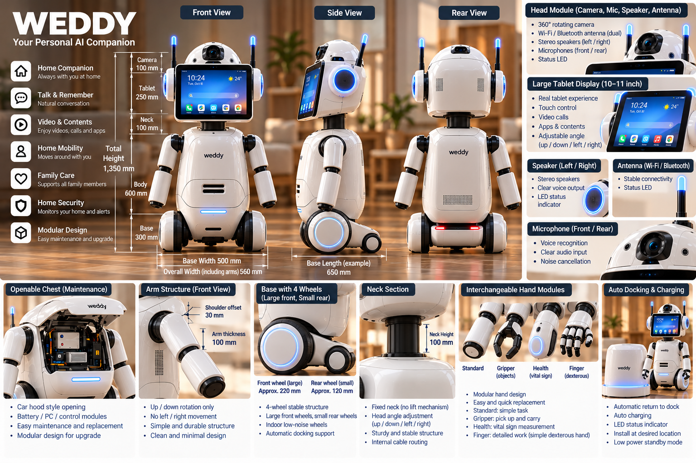

# WEEDY V2 — Personal AI Companion

## WEEDY V2 Concept Design

**Concept Design | October 2026**

> WEEDY V2 is a concept-stage home AI companion robot. The design, dimensions, features, and specifications are preliminary and subject to engineering validation.

## Vision

WEEDY is a modular home AI companion designed to bring natural AI interaction into everyday life.

**One hardware platform. Five AI experiences. Expandable modules.**

WEEDY is designed to grow and adapt with its users, from early childhood through later life.

## WEEDY V2 — Industrial Design

- Premium white, rounded and friendly exterior
- Functional 10–11-inch touchscreen tablet
- Camera module and integrated speakers and microphones
- Fixed neck structure
- Two simple arms with shoulder rotation
- Interchangeable end modules for future expansion
- Front-opening torso compartment for service and upgrades
- Four-wheel indoor mobility platform
- Low-mounted battery system with a removable battery concept
- No rear storage trunk in V2

### Preliminary Dimensions

| Component | Concept Dimension |
|---|---|
| Overall height | 1,350 mm |
| Base height | 300 mm |
| Base width | 500 mm |
| Torso height | 600 mm |
| Torso width | 300 mm |
| Fixed neck | 100 mm |
| Tablet section | 250 mm |
| Camera section | 100 mm |
| Overall width including arms | Approximately 560 mm |

These dimensions are design targets, not validated manufacturing specifications.

## Five AI Experiences

### 1. WEEDY Kids — Preschool
Stories, songs, language development, interactive learning and age-appropriate play.

### 2. WEEDY Junior — Elementary School
School subjects, reading, English conversation, homework guidance and learning habits.

### 3. WEEDY Teen — Middle and High School
Advanced study support, examination preparation, language learning and career exploration.

### 4. WEEDY Adult
Natural AI conversation, schedules, information, communication, media and everyday assistance.

### 5. WEEDY Senior
Companionship, medication reminders, family communication, daily assistance and optional care services.

Age-appropriate safeguards, parental controls and privacy protection are essential requirements.

## Development Roadmap

### Phase 1 — Essential AI Companion
Natural voice conversation, weather, schedules, reminders, photo and video search, tablet media playback and basic interaction.

### Phase 2 — Mobility and Autonomy
Indoor navigation, person-following, obstacle avoidance and automatic charging dock return.

### Phase 3 — Modular Expansion
Interchangeable hand modules, additional sensors, educational services and optional wellness features.

These phases describe intended development goals, not completed implementations.

## AI Service Model

WEEDY aims to provide accessible core AI functions with optional specialized services.

Potential premium services include advanced education, family care and wellness assistance.

A hybrid local/cloud AI architecture is being considered to manage operating costs. Subscription pricing and service economics have not yet been validated.

## M-PIN Integration

WEEDY is a proposed robotics application for M-PIN's owner-controlled persistent state architecture.

Future integration may support continuity of authorized personal settings across device upgrades and AI service changes.

M-PIN integration has not yet been implemented or verified in WEEDY.

## Project Status

- WEEDY V1: Original concept preserved
- WEEDY V2: Updated industrial design and AI service concept
- Functional prototype: Not yet validated
- Commercial production: Not announced

## Project Links

- Website: https://m-pin.net/
- Repository: https://github.com/ceouooll/M-PIN-v2
- WEEDY V1: https://github.com/ceouooll/M-PIN-v2/tree/main/weedy

**WEEDY — A Personal AI Companion for Every Stage of Life.**
